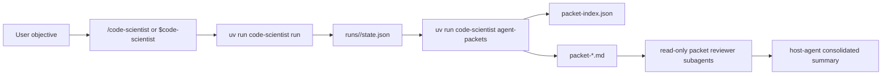

# Code Scientist Agent Slash Command Design

Date: 2026-07-04

## Goal

Make Code Scientist usable from Claude Code and Codex through a reusable project-scoped command workflow that runs the local research engine, generates bounded subagent review packets, spawns independent host-agent reviewers, and consolidates their findings.

## Current Project Fit

Code Scientist already has the core research engine:

- `uv run code-scientist run ...` creates saved runs under `runs/*`.
- `state.json` is the canonical structured artifact.
- `report.md` is the canonical human-readable artifact.
- `RunState` includes hypotheses, reviews, matches, proximity edges, research overview, task queue, agent traces, and retrieval memory.
- Continuous runs and web controls are separate from this slash-command workflow.

The missing integration layer is not another research supervisor. It is an operator entry point for Claude Code and Codex that can turn saved run state into small, independent review tasks.

## Architecture

Add a CLI bridge:

- `code-scientist agent-packets <state.json> --out <packet-dir> --limit <n>`
- Reads a saved `RunState`.
- Selects active top hypotheses, excluding `merged_duplicate` hypotheses.
- Writes `packet-index.json`.
- Writes one markdown packet per selected hypothesis.

Add host-tool entry points:

- Claude Code skill: `.claude/skills/code-scientist/SKILL.md`
- Codex skill: `.agents/skills/code-scientist/SKILL.md`
- Claude subagent: `.claude/agents/code-scientist-packet-reviewer.md`
- Codex custom agent: `.codex/agents/code-scientist-packet-reviewer.toml`

The skill performs orchestration, not research logic:

1. Inspect current repo state.
2. Run Code Scientist or use an existing `state.json`.
3. Generate packet files.
4. Spawn one read-only packet reviewer per packet.
5. Wait for reviewers.
6. Summarize verdicts, risks, and next actions.

## Data Flow

## Packet Contents

Each packet includes:

- Objective and state path.
- Hypothesis id, title, claim, rationale, status, Elo, origin.
- Assumptions, test plan, metrics, success condition, and risks.
- Reviews for the hypothesis, including scores, findings, weaknesses, safety notes, and review ids.
- Resolved evidence records referenced by the hypothesis or reviews.
- Research overview next experiments and limitations when available.
- Required response format for the reviewer.

## Guardrails

- Use `uv`, not `pip` or `python` directly, for project Python commands.
- Treat `state.json` and `report.md` as authoritative.
- Do not treat generated hypotheses as validated without benchmark, human-review, or prospective-validation evidence.
- Packet reviewer subagents are read-only by default.
- Preserve unrelated dirty worktree changes.

## Verification

Required verification:

- Focused CLI test proving `agent-packets` writes `packet-index.json` and packet markdown.
- Full backend test suite with `uv run pytest -q`.
- Skill metadata validation for `.agents/skills/code-scientist` and `.claude/skills/code-scientist`.
- Real smoke run:
  - `uv run code-scientist run ... --out runs/<smoke>`
  - `uv run code-scientist agent-packets runs/<smoke>/state.json --out runs/<smoke>/agent-packets --limit 2`

## Non-Goals

- Do not build a new API service for slash commands.
- Do not make subagents mutate source code during packet review.
- Do not replace the existing workbench command parser.
- Do not claim paper-level validation from packet review alone.
